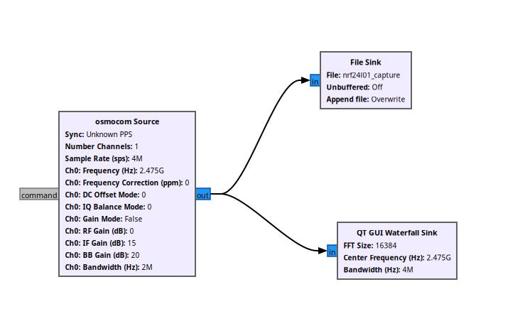
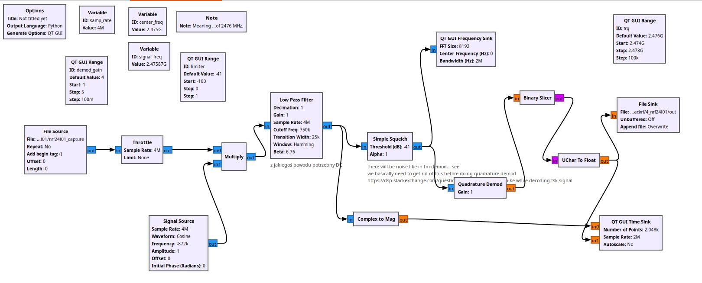
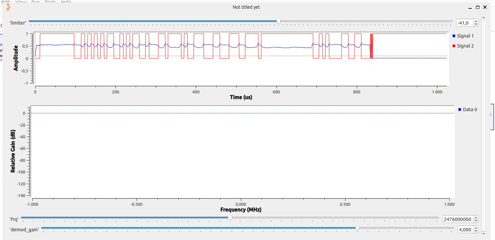

# Intro

One of my hobbies is amateur radio (however, lack of time and poor antena conditions prevents me from making connections).  
I`m also intrested in software defined radio area.  
Couple of months ago I bought HackRF device from aliexpress. This brilliant device allows me to receive/send messages over the air. One of my goals was to learn something more about digital modes. After doing great introduction by Michael Ossmann [Great Scott Gadget Youtube](https://www.youtube.com/watch?v=BeeSN14JUYU) I decided to start signal analysis with some radio remote controller for a toy. This device was using [ASK](https://en.wikipedia.org/wiki/Amplitude-shift_keying) modulation.  
Next step was determined by the hardware I have. Some time ago  (5 years or so...) I acquired a cheap [NR24L01 module](https://howtomechatronics.com/tutorials/arduino/arduino-wireless-communication-nrf24l01-tutorial/).

# NRF24L01 info

Features (from radio pov):  
- 125 different channels  - Channels starting from 2.4 GHz, one channel occupies 1MHz bandwidth.  
- [GFSK](https://en.wikipedia.org/wiki/Frequency-shift_keying) modulation  
Other features:  
- SPI for data exchange with module

I have used Arduino pro mini to connect NRF24L01 module. I have took the [RF24 arduino library](https://github.com/nRF24/RF24) for communication wuth NRF24L01 module.

# Arduino SW

I have used example from NRF24 library - GettingStarted.
Added following setting in app:

``` C++
  radio.setDataRate(RF24_250KBPS);
  // Set the PA Level low to try preventing power supply related problems
  // because these examples are likely run with nodes in close proximity to
  // each other.
  radio.setPALevel(RF24_PA_MAX);  // RF24_PA_MAX is default.
```
This app, depending on choice, is sending/receiving NRF packets.
Communication with user is done by UART.

According to documentation of setChannel() method:  
`Meaning the default channel of 76 uses the approximate frequency of 2476 MHz.`


# Gnu Radio

Basing on other examples and info found in internet, i have prepared following (G)FSK demodulator

For data capture - file capture_data.grc



For processing data:  
Variant 1 file process_data.grc  


Variant 2 file process_data_qr_demod.grc


Here is example output of transmisssion.


# Script for checking NRF24L01 packet

To extract data i have used manual method - eye inspection on waveform.
Once i have gathered all necesary data, i have processed it with simple decoder.
See `nrf24_decoder.py` file. All you need to do is to set correct nrf_packet variable in decoder.

Example output:
```
Decoder started
01010101
preamble OK
processing addr... 
start pos 8 end pos 48, bytes 5
addr is [0x65, 0x64, 0x6f, 0x4e, 0x31]
processing addr... 
align new end pos from 57 to 64
start pos 48 end pos 64, bytes 2
pcf is 0x19e
processing payload... 
start pos 57 end pos 73, bytes 2
payload is [0xff, 0xff]
processing received crc... 
start pos 73 end pos 89, bytes 2
received crc is [0x28, 0x66]
...
b'\x00\xca\xc8\xde\x9cc\x9e\xff\xff'
calculated crc is 0x2866
CRC OK

```

# Bonus: Calculation of CRC

For check data ingegrity, there is a crc check procedure used. Unfortunatley, data is not **byte aligned**. 
There are two mehtods to calculate crc.  

## Method 1: Use bit oriented CRC check procedure. I have wrote my own, basing on Wikipedia.

See file `crc.py`
```
Extended a 011001010110010001101111010011100011000111001111011111111111111110000000000000000
Extended w 10001000000100001
last bit pos 81
AO 0000000011001010110010001101111010011100011000111001111011111111111111110000000000000000
I  0000000111111111111111100000000000000000000000000000000000000000000000000000000000000000
AX 0000000100110101001101101101111010011100011000111001111011111111111111110000000000000000
-----------------
a 0000000100110101001101101101111010011100011000111001111011111111111111110000000000000000
w        100010000001000010000000000000000000000000000000000000000000000000000000000000000
o 0000000000100101000101111101111010011100011000111001111011111111111111110000000000000000

...
-----------------
a 0000000000000000000000000000000000000000000000000000000000000000000001100100100010100000
w                                                                      1000100000010000100
o 0000000000000000000000000000000000000000000000000000000000000000000000100000100000100100
-----------------
a 0000000000000000000000000000000000000000000000000000000000000000000000100000100000100100
w                                                                       100010000001000010
o 0000000000000000000000000000000000000000000000000000000000000000000000000010100001100110
End of calculation
Result: 0x2866
```


## Method 2: Use python built in CRC procedure with non-CITT start value which will compensate the miss alignment. 

To calculate the "compensation" value i have used CRC calc procedure but i did it "backwards". I have calculated the CRC for additional zeros before real data. See - `crc_calculate_comp.py`.
```
...
AO 0000000011001010110010001101111010011100011000111001111011111111111111110000000000000000
AX 0011110011010010110010001101111010011100011000111001111011111111111111110000000000000000
FIX 0011110000011000000000000000000000000000000000000000000000000000000000000000000000000000
Shifting back to orginal format of init val...
FIX 0000000000000000000000000000000000000000000000000000000000000000000000000011110000011000
FIX 0x3c18
```


I have prepared a simple script for analyzing NRF24L01 packet. This analyzer is configured (hardcoded) to decode packets created by adruino app.

# What else ?

Well, I have got working reception of NRF24 signal. I could try to generate this signal using GNU Radio.
It should not be hard to do.


# Links
Modulation:  
[https://en.wikipedia.org/wiki/Frequency-shift_keying](https://en.wikipedia.org/wiki/Frequency-shift_keying)  
CRC:  
[https://www.texttool.com/crc-online](https://www.texttool.com/crc-online)  
[https://www.tahapaksu.com/crc/](https://www.tahapaksu.com/crc/)  
[https://www.ghsi.de/pages/subpages/Online%20CRC%20Calculation/index.php?Polynom=10001000000100001&Message=CAC8DE9C639EFFFF](https://www.ghsi.de/pages/subpages/Online%20CRC%20Calculation/index.php?Polynom=10001000000100001&Message=CAC8DE9C639EFFFF)  
[https://pl.wikipedia.org/wiki/Cykliczny_kod_nadmiarowy](https://pl.wikipedia.org/wiki/Cykliczny_kod_nadmiarowy)  
[https://stackoverflow.com/questions/3411654/best-way-to-generate-crc8-16-when-input-is-odd-number-of-bits-not-byte-c-or-p](https://stackoverflow.com/questions/3411654/best-way-to-generate-crc8-16-when-input-is-odd-number-of-bits-not-byte-c-or-p)  
[https://stackoverflow.com/questions/59087861/how-is-this-crc-calculated-correctly](https://stackoverflow.com/questions/59087861/how-is-this-crc-calculated-correctly)  
NRF:  
[https://lastminuteengineers.com/nrf24l01-arduino-wireless-communication/](https://lastminuteengineers.com/nrf24l01-arduino-wireless-communication/)  
Other NRF Demodulatos:  
[https://github.com/roboremo/NRF24-demodulator](https://github.com/roboremo/NRF24-demodulator)
[http://blog.cyberexplorer.me/2014/01/sniffing-and-decoding-nrf24l01-and.html](http://blog.cyberexplorer.me/2014/01/sniffing-and-decoding-nrf24l01-and.html)
[https://wiki.bitcraze.io/misc:hacks:hackrf](https://wiki.bitcraze.io/misc:hacks:hackrf)
